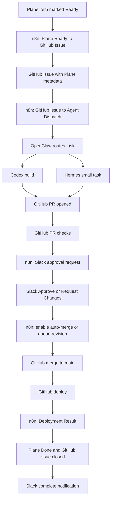

# Agentic Workflow Implementation Plan

## Goal

Move from an idea in Plane to a deployed solution with the fewest reliable human interactions:

1. A human marks a Plane work item `Ready`.
2. The system builds, tests, and opens a PR.
3. Slack sends one approval notification.
4. A human approves or requests changes from Slack.
5. Approved work merges, deploys, and updates Plane.
6. Slack sends one completion notification.

The durable ownership model is:

- Plane stores projects, work items, state, priority, and requirements.
- GitHub is the source of truth for code, issues, PRs, checks, merge history, and deployment history.
- n8n hosts cloud automations and owns orchestration.
- OpenClaw is the messenger and agent router between n8n, Codex, Hermes, and Slack.
- Codex builds code, tests it, and opens or updates PRs.
- Hermes runs bounded local tasks that fit a small model and deterministic tool loop.
- Slack is the human communication and approval surface.

## Interaction Contract

Only two routine Slack notifications should reach humans:

1. Approval needed: sent when a Codex PR is ready and required checks are passing or ready for review.
2. Complete: sent when the approved change has merged, deployed successfully, Plane is moved to `Done`, and the GitHub issue is closed.

Exception notifications are allowed only for blocked states:

- Codex could not start.
- Checks failed and automatic repair attempts were exhausted.
- Deployment failed.
- Required Plane or GitHub metadata could not be resolved.
- Human clarification is required before build.

## Plane State Model

Use one workspace-level state model across all in-scope Plane projects.

| Plane State | Owner | Meaning |
| --- | --- | --- |
| `Idea` | Human | Raw idea or draft. No automation. |
| `Ready` | Human | Requirements are sufficient for automation intake. |
| `Building` | n8n/OpenClaw | GitHub issue is claimed and Codex or Hermes is running. |
| `Review` | n8n/GitHub | PR exists and is ready for approval. |
| `Changes Requested` | Slack/GitHub/n8n | Human asked for a revision. |
| `Approved` | Slack/n8n | Human approved the PR for merge. |
| `Deploying` | GitHub/n8n | Merge happened and deployment is running. |
| `Done` | n8n | Deployment succeeded and source issue is closed. |
| `Blocked` | n8n/Human | Automation cannot continue without intervention. |

State IDs must be resolved dynamically by state name for each Plane project. Workflows must not hardcode state IDs.

## GitHub Queue Contract

n8n should create or update one GitHub issue per Plane work item.

Required issue labels:

- `plane`
- `codex-ready`
- `automation`

Runtime labels:

- `codex-in-progress`
- `codex-pr-open`
- `codex-changes-requested`
- `hermes-in-progress`
- `deploying`
- `done`
- `blocked`

Required metadata in every GitHub issue and PR body:

```text
plane_issue_id:
plane_project_id:
plane_url:
plane_workspace_slug:
github_issue_number:
runner:
source_workflow:
```

The `plane_issue_id` and `plane_project_id` fields are the durable keys for every downstream workflow.

## Runner Routing

Plane should include a custom property named `runner`.

Allowed values:

- `codex`
- `hermes`
- `human`
- `auto`

Default: `auto`.

Routing rules:

| Work Type | Runner |
| --- | --- |
| Code feature, bug fix, migration, test update, app change | Codex |
| n8n workflow implementation or repo-backed automation change | Codex |
| Small deterministic local check, file transform, status report, one-off script, metadata cleanup | Hermes |
| Ambiguous product decision or missing requirements | Human |

`auto` should resolve to Codex unless the task is explicitly small, deterministic, and safe for Hermes.

## Hermes Scope Limits

Hermes uses a small local model: 14B with 64K context. Treat Hermes as a bounded task runner, not a broad coding agent.

Hermes may:

- Read one focused task package at a time.
- Run deterministic scripts.
- Validate JSON, Markdown, SQL, and workflow specs.
- Produce short summaries.
- Apply narrow mechanical edits when the exact target file and change are specified.
- Run local health checks and return structured results.

Hermes must not:

- Own multi-file feature design.
- Infer large architecture changes.
- Perform broad repository exploration.
- Handle long PR reviews.
- Make deployment decisions.
- Modify secrets or credentials.
- Work without a compact task package.

Hermes task packages should fit this shape:

```json
{
  "task_id": "plane-or-github-id",
  "goal": "one sentence",
  "allowed_files": ["path/a", "path/b"],
  "commands": ["command to run"],
  "expected_output": "specific artifact or structured status",
  "stop_conditions": ["missing file", "command failure", "unexpected diff"]
}
```

The target budget for a Hermes task is under 10 minutes and under 5 files.

## Target Automation Flow



## Workflow Inventory

### Existing Workflow: Plane Ready to GitHub Issue

Status: keep and harden.

Responsibilities:

- Receive Plane Ready webhook.
- Normalize payload.
- Resolve Plane project ID from event payload.
- Search GitHub for existing issue by `plane_issue_id`.
- Create GitHub issue only when one does not already exist.
- Add required metadata.
- Add queue labels.
- Comment back to Plane with GitHub issue link.

Required improvements:

- Move Plane to `Building` only after the downstream agent dispatch succeeds.
- Do not send routine Slack queue notifications.
- Ensure every issue includes `runner`, defaulting to `auto`.

### New Workflow: GitHub Issue to Agent Dispatch

Status: missing; build next.

Trigger:

- GitHub `issues` webhook for `opened`, `edited`, `labeled`, and `reopened`.
- Optional schedule fallback every 5 minutes to recover missed webhooks.

Eligibility:

- Issue is open.
- Labels include `plane`, `codex-ready`, and `automation`.
- Labels do not include `codex-in-progress`, `hermes-in-progress`, `codex-pr-open`, `done`, or `blocked`.
- No linked open PR exists.
- Issue body contains `plane_issue_id` and `plane_project_id`.

Responsibilities:

- Acquire an idempotency lock keyed by `github_issue_number`.
- Resolve runner from issue body or Plane property.
- Route through OpenClaw.
- Add `codex-in-progress` or `hermes-in-progress`.
- Move Plane to `Building`.
- Store dispatch metadata in n8n data table.
- On dispatch failure, label `blocked`, move Plane to `Blocked`, and send exception notification.

OpenClaw dispatch payload:

```json
{
  "source": "n8n",
  "event": "github_issue_ready",
  "repo": "choicedrum-crypto/agentic-buildout-starter",
  "github_issue_number": 123,
  "plane_issue_id": "uuid",
  "plane_project_id": "uuid",
  "runner": "codex",
  "callback_url": "https://n8n.tradecredit.agency/webhook/agent-result"
}
```

### New Workflow: Agent Result to GitHub and Plane

Status: missing; build after dispatch.

Trigger:

- OpenClaw callback when Codex or Hermes finishes.

Responsibilities:

- If a PR was opened, add `codex-pr-open`, remove in-progress labels, and move Plane to `Review`.
- If Hermes produced a small artifact that needs PR creation, hand off to Codex unless explicitly configured for direct PR.
- If the runner failed recoverably, request one automatic Codex retry.
- If retry budget is exhausted, move Plane to `Blocked` and send exception notification.

### Existing Workflow: GitHub PR to Slack Review

Status: keep, then convert to approval-button flow.

Responsibilities:

- Receive PR webhooks.
- Parse Plane metadata.
- Resolve project state IDs dynamically.
- Move Plane to `Review`.
- Wait for required checks to pass before sending approval notification.
- Send exactly one Slack approval message per PR revision that is ready for human decision.

Slack approval message should include:

- Plane title and link.
- PR link.
- GitHub issue link.
- Short Codex summary.
- Check status.
- Buttons: `Approve`, `Request Changes`, `Block`.

Do not send separate queue or review chatter for normal progress.

### New Workflow: Slack Approval to Merge

Status: missing; build after approval message.

Trigger:

- Slack interactive button callback.

Actions:

- `Approve`: move Plane to `Approved`, enable GitHub auto-merge or merge the PR after required checks pass.
- `Request Changes`: move Plane to `Changes Requested`, create a GitHub PR comment with the request, and dispatch Codex revision.
- `Block`: move Plane to `Blocked`, label PR/issue `blocked`, and stop automation.

Merge requirements:

- PR branch is up to date or merge queue can update it.
- Required checks passed.
- PR has Plane metadata.
- PR is not draft.
- No `blocked` label exists.

### Existing Workflow: Deployment Result to Plane and Slack

Status: keep and harden before relying on it.

Required improvements:

- Parse `plane_project_id` from PR body or linked issue body.
- Resolve `Deploying`, `Done`, `Review`, and `Blocked` state IDs dynamically by state name.
- Move Plane to `Deploying` when deploy starts.
- Move Plane to `Done` only after successful deploy.
- Close the linked GitHub issue only after successful deploy.
- Send the one routine Slack completion notification.

Completion notification should include:

- Plane link.
- PR link.
- Deployment run link.
- Final status.

## Data Tables

n8n should own small operational data tables for idempotency and audit.

### `plane_ready_issue_locks`

Key: `plane_issue_id`

Fields:

- `plane_project_id`
- `github_issue_number`
- `github_issue_url`
- `created_at`
- `updated_at`

### `agent_dispatch_locks`

Key: `github_issue_number`

Fields:

- `plane_issue_id`
- `plane_project_id`
- `runner`
- `status`
- `dispatch_id`
- `attempt_count`
- `last_error`
- `created_at`
- `updated_at`

### `slack_approval_locks`

Key: `pr_number`

Fields:

- `plane_issue_id`
- `plane_project_id`
- `approval_message_ts`
- `approval_status`
- `approved_by`
- `approved_at`
- `created_at`
- `updated_at`

## GitHub Actions Requirements

PR checks must remain the quality gate.

Required checks:

- Validate n8n workflow specs.
- Verify n8n spec changes have matching publish implementation.
- Run project-specific tests when present.
- Check for committed secret patterns.

Deployment must remain GitHub-owned:

- Deploy only from `main`.
- Publish n8n workflows during deploy.
- Report deployment result through GitHub `workflow_run` webhook.
- Never give Codex production deployment credentials.

## OpenClaw Contract

OpenClaw should be a message router, not a source of truth.

It receives:

- Agent dispatch requests from n8n.
- Agent result callbacks from Codex and Hermes.
- Slack approval actions when n8n delegates routing.

It returns:

- `accepted`
- `runner_started`
- `runner_failed`
- `pr_opened`
- `revision_pushed`
- `blocked`

Each message should include correlation IDs:

- `plane_issue_id`
- `plane_project_id`
- `github_issue_number`
- `pr_number`, when known
- `dispatch_id`

## Implementation Phases

### Phase 1: Stabilize Metadata and State Resolution

Deliverables:

- Ensure Plane Ready issues include all required metadata.
- Patch Deployment Result workflow to use dynamic `plane_project_id`.
- Patch Deployment Result workflow to resolve state IDs by name.
- Update specs and builder together.

Validation:

- Trigger a test Plane item in a non-production project.
- Confirm GitHub issue body includes all metadata.
- Confirm PR and deploy workflows can update the same Plane project without hardcoded IDs.

### Phase 2: Build GitHub Issue to Agent Dispatch

Deliverables:

- Add n8n spec and builder implementation.
- Add idempotency table use.
- Add OpenClaw dispatch call.
- Add label-based claim behavior.
- Move Plane to `Building` only after dispatch acceptance.

Validation:

- Create a synthetic GitHub issue with Plane metadata.
- Confirm n8n claims it once.
- Confirm duplicate webhooks do not create duplicate dispatches.
- Confirm failed dispatch moves Plane to `Blocked` and sends exception notification.

### Phase 3: Codex Build Callback

Deliverables:

- Define OpenClaw-to-n8n callback endpoint.
- Update Codex run prompt contract to include Plane metadata in PR body.
- Add Agent Result workflow.
- Label issue `codex-pr-open` when PR exists.
- Move Plane to `Review`.

Validation:

- Dispatch one safe repo-contained issue.
- Confirm Codex opens PR with required metadata.
- Confirm Plane moves to `Review`.

### Phase 4: Slack Approval Buttons

Deliverables:

- Replace routine PR review notification with approval-button message.
- Add Slack Approval to Merge workflow.
- Add `Approve`, `Request Changes`, and `Block` actions.
- Add approval idempotency table.

Validation:

- Confirm only one approval notification appears for a ready PR.
- Click `Request Changes`; confirm Codex revision is queued.
- Click `Approve`; confirm Plane moves to `Approved`.

### Phase 5: Auto-Merge and Deploy

Deliverables:

- Enable GitHub auto-merge or implement n8n merge-after-checks.
- Require passing checks and approved Slack action.
- Move Plane to `Deploying` on deployment start.
- Move Plane to `Done` on deployment success.
- Close source GitHub issue.
- Send completion notification.

Validation:

- Approve a test PR from Slack.
- Confirm merge happens without another human action.
- Confirm deploy runs from `main`.
- Confirm Plane moves to `Done`.
- Confirm GitHub issue closes.
- Confirm Slack sends exactly one completion notification.

### Phase 6: Hermes Bounded Task Runner

Deliverables:

- Define Hermes task package schema.
- Add OpenClaw route for `runner=hermes`.
- Add Hermes result callback handling.
- Limit Hermes to small deterministic tasks.
- Escalate to Codex or human when scope exceeds limits.

Validation:

- Run a JSON validation task.
- Run a small docs update task.
- Confirm Hermes refuses or escalates broad tasks.

## Acceptance Criteria

The system is ready when:

- A Plane task marked `Ready` creates exactly one GitHub issue.
- The GitHub issue is claimed exactly once.
- Codex or Hermes starts without manual prompting.
- Codex opens a PR with required metadata.
- Slack sends one approval notification.
- Slack approval triggers merge or auto-merge after checks pass.
- GitHub deploys from `main`.
- Successful deploy moves Plane to `Done`.
- Successful deploy closes the GitHub issue.
- Slack sends one completion notification.
- Normal successful path produces no other Slack messages.

## Build Order

Recommended immediate order:

1. Patch Deployment Result workflow dynamic project and state resolution.
2. Build GitHub Issue to Agent Dispatch.
3. Wire OpenClaw dispatch to Codex.
4. Add Agent Result callback workflow.
5. Convert PR review Slack message into approval buttons.
6. Add Slack Approval to Merge workflow.
7. Add Hermes route with strict small-task limits.

This order protects the end of the pipeline before adding more automatic starts at the front.
