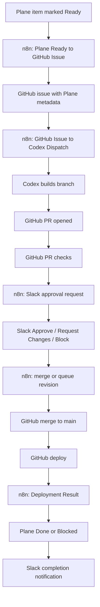

# Agentic Workflow Implementation Plan

## Goal

Move from an idea in Plane to a deployed solution with the fewest reliable human interactions:

1. A human marks a Plane work item `Ready`.
2. n8n creates or reuses a GitHub issue.
3. n8n dispatches Codex to build the issue.
4. Codex opens or updates a PR.
5. Slack sends one approval notification with buttons.
6. A human approves, requests changes, or blocks from Slack.
7. Approved work merges, deploys, and updates Plane.
8. Slack sends one completion notification.

## Ownership

- Plane stores projects, work items, state, priority, and requirements.
- GitHub is the source of truth for code, issues, PRs, checks, merge history, and deployment history.
- n8n owns orchestration, state sync, webhook handling, and Slack notifications.
- Codex builds code, tests it, and opens or updates PRs.
- Slack is the human approval and completion surface.

OpenClaw, Hermes, and local LLM services are not part of the critical build path. They can be added later for bounded side workflows, but the primary Plane-to-deploy loop should remain n8n + Codex + GitHub + Slack.

## Interaction Contract

Only two routine Slack notifications should reach humans:

1. Approval needed: sent when a Codex PR is ready for human decision.
2. Complete: sent when the approved change has merged, deployed, Plane is updated, and the GitHub issue is closed or marked blocked.

Exception notifications are allowed only for blocked states:

- Codex could not be dispatched.
- Checks failed and automatic repair attempts were exhausted.
- Deployment failed.
- Required Plane or GitHub metadata could not be resolved.
- Human clarification is required before build.

## Plane State Model

Use one workspace-level state model across all in-scope Plane projects.

| Plane State | Owner | Meaning |
| --- | --- | --- |
| `Idea` | Human | Raw idea or draft. No automation. |
| `Ready` | Human | Requirements are sufficient for automation intake. |
| `Building` | n8n/Codex | GitHub issue is claimed and Codex is running. |
| `Review` | n8n/GitHub | PR exists and is ready for approval. |
| `Changes Requested` | Slack/GitHub/n8n | Human asked for a revision. |
| `Approved` | Slack/n8n | Human approved the PR for merge. |
| `Deploying` | GitHub/n8n | Merge happened and deployment is running. |
| `Done` | n8n | Deployment succeeded and source issue is closed. |
| `Blocked` | n8n/Human | Automation cannot continue without intervention. |

State IDs must be resolved dynamically by state name for each Plane project. Workflows must not hardcode state IDs as the primary path.

## GitHub Queue Contract

n8n should create or update one GitHub issue per Plane work item.

Required issue labels:

- `plane`
- `codex-ready`
- `automation`

Runtime labels:

- `codex-in-progress`
- `codex-pr-open`
- `codex-changes-requested`
- `deploying`
- `done`
- `blocked`

Required metadata in every GitHub issue and PR body:

```text
plane_issue_id:
plane_project_id:
plane_url:
plane_workspace_slug:
github_issue_number:
source_workflow:
```

The `plane_issue_id` and `plane_project_id` fields are the durable keys for every downstream workflow.

## Target Automation Flow



## Workflow Inventory

### Plane Ready to GitHub Issue

Status: existing; keep and harden.

Responsibilities:

- Receive Plane Ready webhook.
- Normalize payload.
- Resolve Plane project ID from event payload.
- Search GitHub for existing issue by `plane_issue_id`.
- Create GitHub issue only when one does not already exist.
- Add required metadata.
- Add queue labels.
- Comment back to Plane with GitHub issue link.
- Do not send routine Slack queue notifications.

### GitHub Issue to Codex Dispatch

Status: new.

Trigger:

- GitHub `issues` webhook for `opened`, `edited`, `labeled`, and `reopened`.
- Optional schedule fallback can be added later for missed webhooks.

Eligibility:

- Issue is open.
- Labels include `plane`, `codex-ready`, and `automation`.
- Labels do not include `codex-in-progress`, `codex-pr-open`, `done`, or `blocked`.
- Issue body contains `plane_issue_id` and `plane_project_id`.
- Issue is not a pull request.

Responsibilities:

- Claim issue with `codex-in-progress`.
- Dispatch Codex with repo, GitHub issue, Plane issue, and Plane project metadata.
- Move Plane to `Building` only after dispatch succeeds.
- Ignore duplicate or already-claimed webhook deliveries.
- Send no routine Slack notification.

Codex dispatch payload:

```json
{
  "source": "n8n",
  "event": "codex_issue_ready",
  "repo": "choicedrum-crypto/agentic-buildout-starter",
  "github_issue_number": 123,
  "github_issue_url": "https://github.com/choicedrum-crypto/agentic-buildout-starter/issues/123",
  "plane_issue_id": "uuid",
  "plane_project_id": "uuid",
  "plane_url": "https://app.plane.so/...",
  "expected_pr_metadata": [
    "plane_issue_id",
    "plane_project_id",
    "github_issue_number",
    "plane_url"
  ]
}
```

### GitHub PR to Slack Approval

Status: existing; convert to approval-button flow.

Responsibilities:

- Receive PR webhooks.
- Parse Plane metadata.
- Resolve project state IDs dynamically.
- Move Plane to `Review`.
- Send exactly one Slack approval message per PR revision that is ready for human decision.

Slack approval message should include:

- Plane title and link.
- PR link.
- GitHub issue link.
- Check status.
- Short Codex summary.
- Buttons: `Approve`, `Request Changes`, `Block`.

### Slack Approval to Merge

Status: new.

Trigger:

- Slack interactive button callback.

Actions:

- `Approve`: merge the PR through GitHub. Branch protection remains the final safety gate.
- `Request Changes`: comment on the PR with `/codex revise` and move Plane to `Changes Requested`.
- `Block`: comment on the PR, label blocked, and move Plane to `Blocked`.

Merge requirements:

- Required checks passed.
- PR has Plane metadata.
- PR is not draft.
- No `blocked` label exists.

### Deployment Result to Plane and Slack

Status: existing; harden before relying on it.

Responsibilities:

- Parse `plane_project_id` from PR body or linked issue body.
- Resolve `Deploying`, `Done`, `Review`, and `Blocked` state IDs dynamically by state name.
- Move Plane to `Deploying` when deploy starts.
- Move Plane to `Done` only after successful deploy.
- Close the linked GitHub issue only after successful deploy.
- Move Plane to `Blocked` on failed deploy.
- Send the one routine Slack completion notification.

Completion notification should include:

- Plane link.
- PR link.
- Deployment run link.
- Final status.

## GitHub Actions Requirements

PR checks must remain the quality gate.

Required checks:

- Validate n8n workflow specs.
- Verify n8n spec changes have matching publish implementation.
- Run project-specific tests when present.
- Check for committed secret patterns.

Deployment must remain GitHub-owned:

- Deploy only from `main`.
- Publish n8n workflows during deploy.
- Report deployment result through GitHub `workflow_run` webhook.
- Never give Codex production deployment credentials.

## Implementation Phases

### Phase 1: Stabilize Metadata and State Resolution

- Ensure Plane Ready issues include all required metadata.
- Patch Deployment Result workflow to use dynamic `plane_project_id`.
- Patch Deployment Result workflow to resolve state IDs by name.

### Phase 2: Build GitHub Issue to Codex Dispatch

- Add n8n spec and builder implementation.
- Add label-based claim behavior.
- Move Plane to `Building` only after dispatch acceptance.

### Phase 3: Slack Approval Buttons

- Replace routine PR review notification with approval-button message.
- Add Slack Approval to Merge workflow.
- Add `Approve`, `Request Changes`, and `Block` actions.

### Phase 4: Auto-Merge and Deploy

- Require passing checks and approved Slack action.
- Move Plane to `Deploying` on deployment start.
- Move Plane to `Done` on deployment success.
- Close source GitHub issue.
- Send completion notification.

## Acceptance Criteria

The system is ready when:

- A Plane task marked `Ready` creates exactly one GitHub issue.
- The GitHub issue is claimed exactly once.
- Codex starts without manual prompting.
- Codex opens a PR with required metadata.
- Slack sends one approval notification.
- Slack approval triggers merge after checks pass.
- GitHub deploys from `main`.
- Successful deploy moves Plane to `Done`.
- Successful deploy closes the GitHub issue.
- Slack sends one completion notification.
- Normal successful path produces no other Slack messages.

## Build Order

Recommended immediate order:

1. Patch Deployment Result workflow dynamic project and state resolution.
2. Build GitHub Issue to Codex Dispatch.
3. Convert PR review Slack message into approval buttons.
4. Add Slack Approval to Merge workflow.
5. Test one small Plane item end to end.
